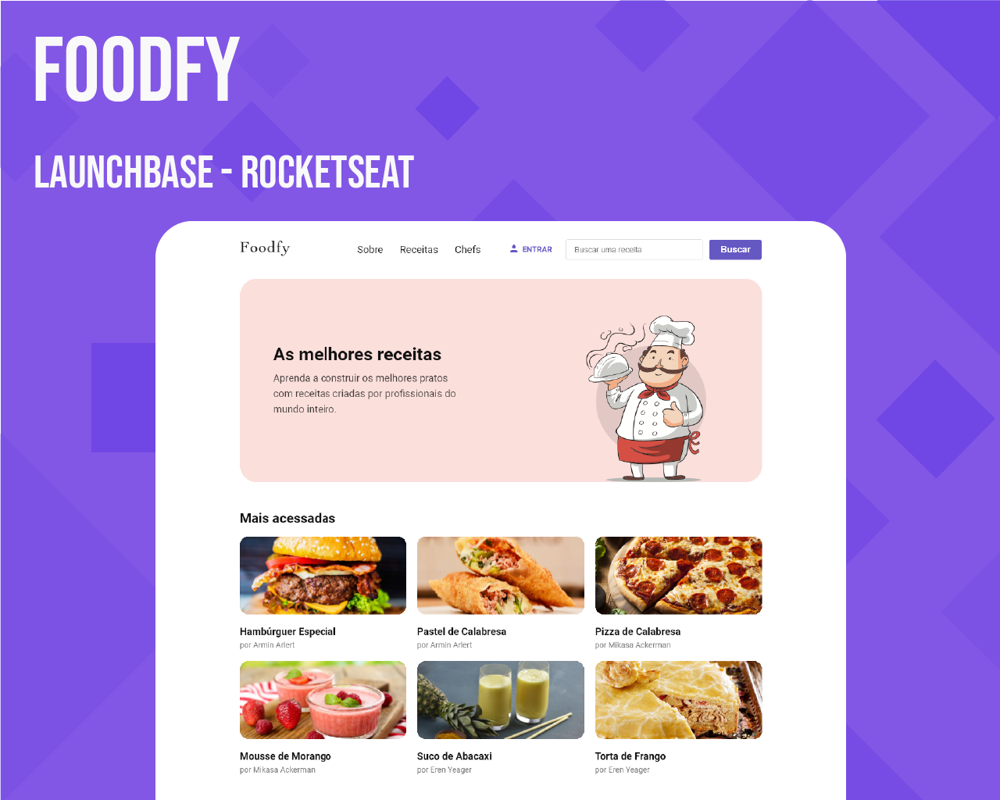

# LaunchBase Rocketseat - Desafio Foodfy

<br><br>


## Índice

- [LaunchBase Rocketseat - Desafio Foodfy](#launchbase-rocketseat---desafio-foodfy)
  - [Índice](#índice)
  - [Visão Geral](#visão-geral)
    - [**O desafio**](#o-desafio)
  - [Meu processo](#meu-processo)
    - [**Construído com**](#construído-com)
    - [**O que eu aprendi**](#o-que-eu-aprendi)
  - [Autor](#autor)

<br>

## Visão Geral

### **O desafio**

O Foodfy é um projeto que foi desenvolvido através de desafios propostos durante o bootcamp LaunchBase da Rocketseat. A cada fase/módulo do bootcamp, o nível de dificuldade veio aumentando, e para colocarmos em prática o que aprendemos, eram propostos novos desafios, e então aplicamos essas novas habilidades, implementando e refatorando todo o projeto com métodos modernos.
<br><br>

Fique a vontade para conferir, todos os desafios propostos durante o bootcamp.
<br>
Cada Link dos desafios abaixo, possuem outros desafios para desenvolvimento continuado, com instruções do que deveria ser feito no projeto.
<br>


- Módulo 1 - Desafio 1: [Introdução a Programação WEB](https://github.com/rocketseat-education/bootcamp-launchbase-desafios-01)

- Módulo 2 - Desafio 2: [Iniciando no Front-end](https://github.com/rocketseat-education/bootcamp-launchbase-desafios-02)

- Módulo 3 - Desafio 3: [Iniciando no Back-end](https://github.com/rocketseat-education/bootcamp-launchbase-desafios-03)

- Módulo 4 - Desafio 4: [Controle de Academia](https://github.com/rocketseat-education/bootcamp-launchbase-desafios-04)

- Módulo 5 - Desafio 5: [Persistindo dados da aplicação](https://github.com/rocketseat-education/bootcamp-launchbase-desafios-05)

- Módulo 6 - Desafio 6: [E-commerce Launchstore](https://github.com/rocketseat-education/bootcamp-launchbase-desafios-06)

- Módulo 7 - Desafio 7: [Upload de Imagens](https://github.com/rocketseat-education/bootcamp-launchbase-desafios-07)

- Módulo 8 - Desafio 8: [Listagem de Produtos](https://github.com/rocketseat-education/bootcamp-launchbase-desafios-08)

- Módulo 10 - Desafio 10: [Sessão de Usuários](https://github.com/rocketseat-education/bootcamp-launchbase-desafios-10)

- Módulo 11 - Desafio 11: [Conceitos Avançados](https://github.com/rocketseat-education/bootcamp-launchbase-desafios-11)

<br>

## Meu processo

### **Construído com**

- HTML5
- CSS3
- JavaScript
- Node.js
- Express
- Nunjucks
- PostgreSQL

<br>

### **O que eu aprendi**

Neste desafio, pude entender desde conceitos básicos sendo aplicados no JavaScript, aprendendo sobre comentários no ambiente de desenvolvimento, strings, numbers, vetores, funções, métodos, laços de repetição e muitos outros conceitos úteis e importantes. E evoluindo para conceitos avançados como o template engine, onde utilizamos o [Nunjucks](https://mozilla.github.io/nunjucks/), para gerenciar melhor as páginas, deixando o projeto dinâmico e inteligente.

Para Back End, aprendi a como criar o primeiro servidor com o Node.js de forma básica, e então evoluímos, implementando o padrão de arquitetura de software MVC([Model View Controller](https://en.wikipedia.org/wiki/Model%E2%80%93view%E2%80%93controller)) e também adicionando o [Banco de Dados PostgreSQL](https://www.postgresql.org/).

Com o PostgreSQL, o projeto ficou massa de ser desenvolvido, já que todos os dados eram melhor gerenciados, com relacionamento de tabelas, trazendo um melhor entendimento e facilidade para o desenvolvimento do Foodfy.

<br>
Exemplo de utilização do Nunjucks no projeto:

```Html
<body>
        

        
            
        

        <main>
            <div class="container">
                
                

                
                    <div 
                        class="pagination"
                        data-page={{pagination.page}}
                        data-total={{pagination.total}}
                        data-search={{search}}
                    ></div>
                
            </div>
            
                
                <footer>
                    <span>Todos os direitos reservados, receitas Foodfy</span>
                </footer>
            

            <script src="/scripts.js"></script>
        </main>
    </body>
```

## Autor

- Linkedin - [Marco Santana](https://www.linkedin.com/in/marco-jsantana/)
